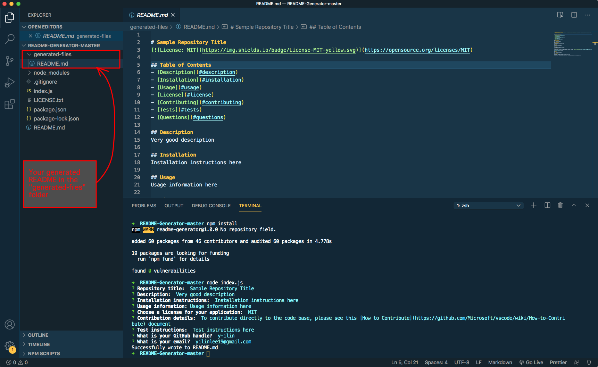

# README Generator

[](https://opensource.org/licenses/MIT)

## Table of Contents

- [Description](#description)
- [Installation](#installation)
- [Usage](#usage)
- [License](#license)
- [Contributing](#contributing)

## Description

This command-line application allows for users to easily generate a README for their project. Generated README's will contain the following information:

- Title
- Description
- Table of Contents
- Installation
- Usage
- License
- Contributing
- Tests
- Questions

## Installation

Clone or download the package and open terminal in the package directory. Then run the following command to install all the dependencies in the local node_modules folder:

```
npm install
```

## Usage

After installation, you can then run the following command to run the application:

```
node index.js
```

Your generated README will be located in the "generated-files" folder.

A screenshot of the entire run-through and the resulting README file:


A video version of the full run-through can be found [here](https://github.com/y-ilin/README-Generator/tree/master/assets).

## License

Licensed under the MIT License.

## Contributing

To contribute directly to the code base, please see this [How to Contribute](https://github.com/Microsoft/vscode/wiki/How-to-Contribute) document
